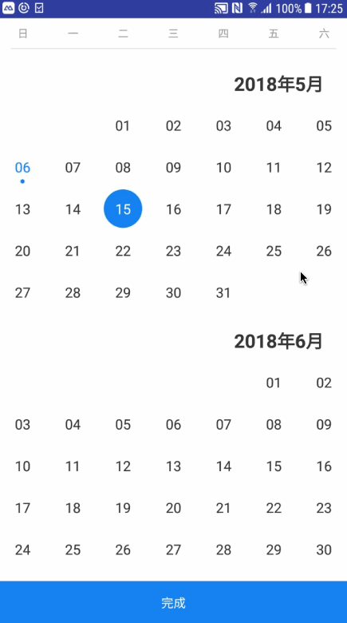
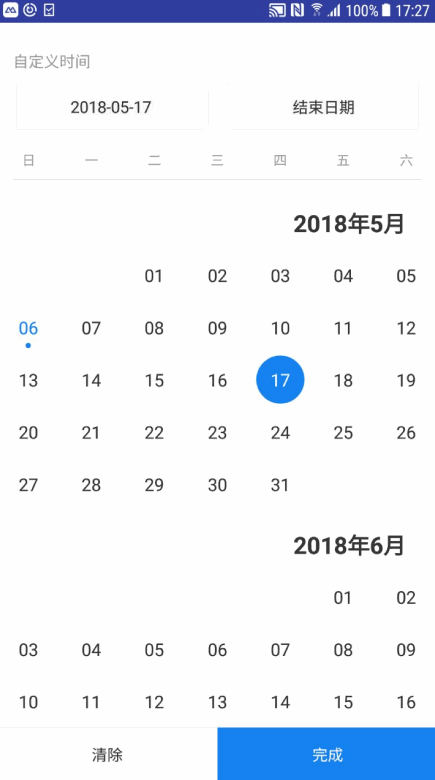

# Calendar_Select

日历选择这个库支持单选日期以及选择时间段，
并且可以设置第一次进入 是选中第一天，还是当天， 还是最后一天。
废话少说了，直接上效果图

# 效果图

#下载

    implementation 'com.richzjc:calendar_select:1.0.0'

# 使用

**示例**

    <com.rich.library.CalendarSelectView
            android:layout_width="match_parent"
            android:layout_height="match_parent"
            android:id="@+id/calendar_select"
            android:clickable="true"
            app:locate_position="today"
            app:select_type="mult">

    
select_type 属性有如下：
* mult（选择时间段）
* single （单选日期）

locate_position属性如下：
* start (初始选中开始)
* today（初始选中当天，如果当天不在范围之内，则选中最后一天）
* end （初始选中最后一天）

获取选中的日期 以及区间段，`只需要给当前控件设置这个callback即可`

    ConfirmSelectDateCallback selectDateCallback = new ConfirmSelectDateCallback() {
            @Override
            public void selectSingleDate(DayTimeEntity timeEntity) {
                //TODO 单选回调此方法
            }
            
            @Override
            public void selectMultDate(DayTimeEntity startTimeEntity, DayTimeEntity endTimeEntity) {
                //TODO 选择时间段回调些方法
            }
        };
        
`调用此方法： setConfirmCallback(selectDateCallback);`
        
该控件默认的时间区间是： 向前一年，向后三个月， 如果需要更改控件的时间区间，请调用如下方法：
   
    setCalendarRange(Calendar startCalendar, Calendar endCalendar, DayTimeEntity startDayTime, DayTimeEntity endDayTime) 
   
**参数说明**
   
startCalendar: 该控件展示的起始月份

endCalendar: 该控件展示的结束月份

startDayTime: 控制能点击的日期，只有在startDayTime 和 endDayTime之前的日期是可点击的

endDayTime: 控制能点击的日期，只有在startDayTime 和 endDayTime之前的日期是可点击的
    
**欢迎各位fork 和 star**